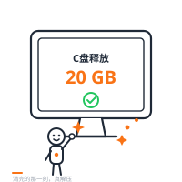
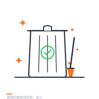

<p align="center">
  
</p>

<h1 align="center">ikevss C盘清理</h1>

<p align="center">
  <b>C 盘又红了？让 AI 帮你看清楚、扫干净。</b><br>
  纯 Windows 只读磁盘分析 · 三灯分级 · 一键安全清理 · 删掉的都能找回来
</p>

<p align="center">
  <a href="https://ikevss.github.io/ikevss-c-cleaner/">🌐 官网</a> ·
  <a href="#快速开始">🚀 快速开始</a> ·
  <a href="#它怎么保护你的文件">🛡️ 安全说明</a> ·
  <a href="#给懂技术的朋友">⚙️ 技术细节</a>
</p>

<p align="center">
  
  
  
  
</p>

---

## 是不是也遇到过这些时刻？

<p align="center"></p>

- 💾 **「C 盘又满了」** —— 弹窗提示空间不足，你却不知道空间都被谁吃了
- 🤔 **「这个文件夹能删吗」** —— 看着一堆英文目录名，不敢下手，怕删错东西
- 😰 **「删了就回不来了吧」** —— 想清理，又担心一不小心把重要文件弄丢

**这个工具就是为解决这三件事做的。**

它不会闷头就删。它会先**看清楚**你的每一块空间去了哪里，然后像一位懂电脑的朋友一样告诉你：**哪些可以放心清、哪些要想一想、哪些千万别碰**——最后，只清理你点头同意的那些。

> 🧡 而且，**删掉的东西都先进回收站**。反悔了，随时能找回来。

---

## 它是怎么帮你分辨的？—— 三灯分级

扫描完成后，每一项空间占用都会被标上一种颜色，就像红绿灯一样直观：

| 灯 | 含义 | 你可以做什么 | 比如 |
|----|------|------------|------|
| 🟢 **绿色** | 可以放心清 | 点一下，一键清进回收站 | 浏览器缓存、软件更新残留、临时文件 |
| 🟡 **黄色** | 需要你想一想 | 它会告诉你里面是什么、怎么清最安全 | 微信/钉钉聊天数据、下载文件夹、WPS 模板 |
| 🔴 **红色** | 别直接删 | 它给你正规的卸载步骤 | 不用的大型软件、系统组件 |

**你只需要对绿色点一下，就能释放几个甚至几十个 GB。** 黄色和红色，它会把决定权完全交给你。

---

## 快速开始

**第 1 步 · 安装**（只需要一次）

把本项目放到你的 AI 助手（如 Claude Code）的技能目录：

```
C:\Users\<你的用户名>\.claude\skills\ikevss-c-cleaner\
```

**第 2 步 · 说一句话**

对你的 AI 助手说：

> 「帮我清理一下 C 盘」

**第 3 步 · 剩下的交给它**

它会扫描磁盘（约十几秒）→ 生成一份清晰的彩色报告 → 在浏览器里打开给你看。

<p align="center"></p>

**前提**：电脑上装了 [Python 3.10 或更高版本](https://www.python.org/downloads/)（免费，官网下载安装即可）。不需要装任何其他东西。

---

## 它怎么保护你的文件？

我们比你更怕删错东西，所以设计了层层保险：

- 👀 **扫描全程只读** —— 分析阶段只是「看」，不写、不改、不删任何文件
- 🗑️ **删除先进回收站** —— 默认「移到回收站」而不是永久删除，给你留足后悔的余地
- ✋ **动手前必须确认** —— 分级完成后它会停下来问你「确认吗」，你不点头，绝不擅自删除
- 🔒 **七层安全校验** —— 清理服务只在你自己电脑上运行，外部网络碰不到你的文件

---

## 给懂技术的朋友

<details>
<summary><b>展开技术细节</b></summary>

### 命令行直接用

```bash
# 完整扫描，输出 JSON
python scripts/scan.py

# 快速模式：只看大概，0.3 秒
python scripts/scan.py --quick

# 缓存模式：24 小时内二次扫描 < 0.1 秒
python scripts/scan.py --cache

# 生成静态 HTML 报告
python scripts/build_report.py analysis.json

# 启动交互式服务（支持网页内一键清理）
python scripts/server.py analysis.json
```

### 架构

| 文件 | 作用 |
|------|------|
| `scripts/scan.py` | 只读扫描器，覆盖 12 组扫描目标，输出 JSON |
| `scripts/build_report.py` | 把分析结果注入 HTML 模板，生成静态报告 |
| `scripts/server.py` | 本地 HTTP 服务 + 删除 API（七层安全校验） |
| `assets/report_template.html` | 交互式报告前端 |
| `references/windows.md` | Windows 目录布局与分级参考 |

### 扫描覆盖

12 组目标：用户目录、AppData、下载、Program Files、系统盲区（Installer / ProgramData / WinSxS / 回收站）、12 种开发缓存（pip/npm/uv/cargo/playwright…）、hiberfil/pagefile 检测。

### 安全设计

- 删除 API 绑定 `127.0.0.1`，外部不可达
- 七层校验：Content-Length → Host → JSON → Token → 白名单 → 路径 → 根目录
- 只能删除报告中已列出的路径
- 移到回收站使用 `SHFileOperationW`（可撤销）

### 零依赖

全部使用 Python 标准库（`os` / `shutil` / `json` / `http.server` / `ctypes`），无需 `pip install` 任何东西。

</details>

---

## 常见问题

**Q：它会偷偷删我的东西吗？**
不会。扫描阶段完全只读；删除前一定会先给你看分级结果、等你确认；而且删除默认是「移到回收站」，可以撤销。

**Q：我不懂电脑，能用吗？**
可以。你只需要说「帮我清理 C 盘」，然后照着报告上的绿色项点就行。所有操作都有中文说明。

**Q：为什么有的项是黄色，不能直接清？**
因为那些目录里可能有你的聊天记录、文档或设计文件——只有你自己知道哪些重要。工具会告诉你里面是什么、怎么清最安全，但把决定权留给你。

**Q：支持 Windows 7 吗？**
没测试过，推荐在 Windows 10 / 11 上使用。

---

## 项目信息

- 🌐 **官网**：[ikevss.github.io/ikevss-c-cleaner](https://ikevss.github.io/ikevss-c-cleaner/)
- 💬 **反馈**：[提交 Issue](https://github.com/ikevss/ikevss-c-cleaner/issues)
- 📄 **协议**：MIT License · Copyright © 2026 ikevss

<p align="center"><sub>用 ❤ 和一点橙色做的 🧡</sub></p>
